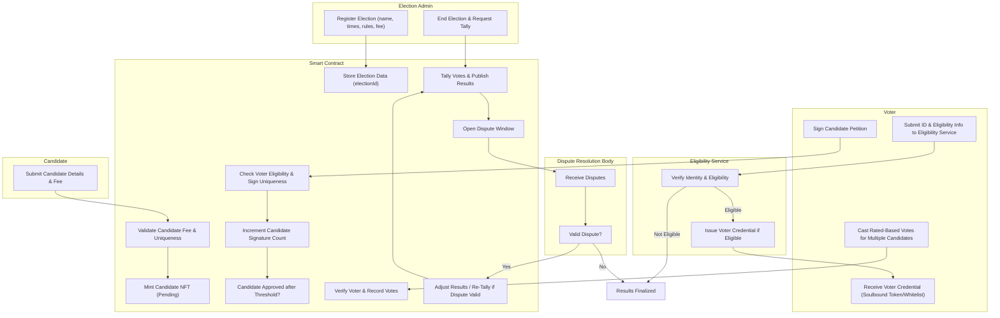
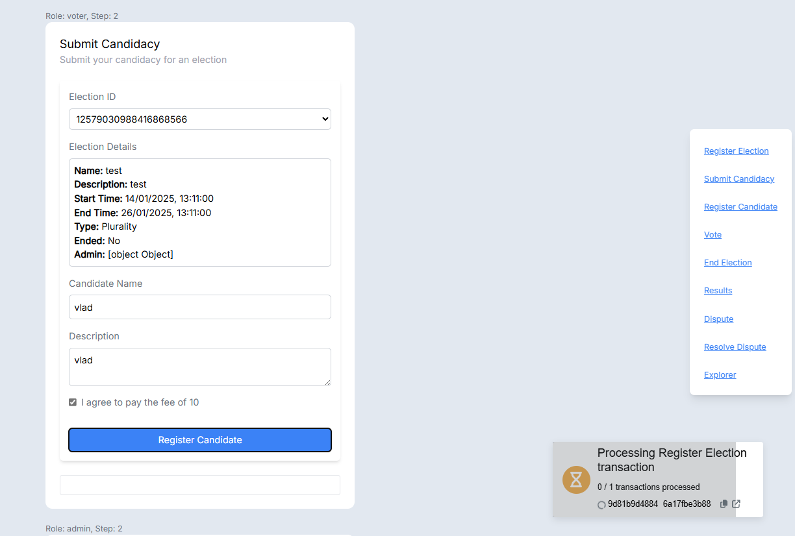
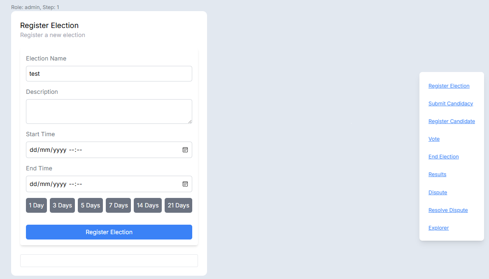
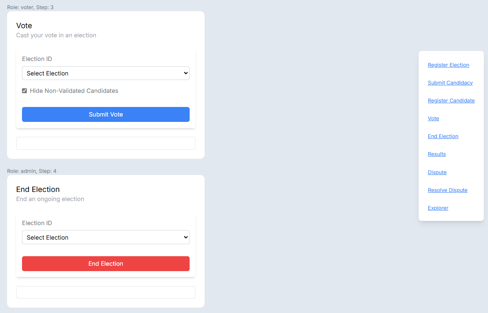

# Blockchain Protocols - Project

- [Blockchain Protocols - Project](#blockchain-protocols---project)
  - [Voting Web Application Based on the MultiversX Blockchain](#voting-web-application-based-on-the-multiversx-blockchain)
    - [Team Members](#team-members)
    - [Purpose of the Project](#purpose-of-the-project)
    - [Needs It Tries to Satisfy](#needs-it-tries-to-satisfy)
    - [Components of the Project](#components-of-the-project)
    - [Data Flow for Blockchain-Based Election App (Rated-Based Voting)](#data-flow-for-blockchain-based-election-app-rated-based-voting)
      - [1. Voter Eligibility and Registration](#1-voter-eligibility-and-registration)
      - [2. Election Registration](#2-election-registration)
      - [3. Candidate Registration](#3-candidate-registration)
      - [4. Signature Collection (Candidate Approval)](#4-signature-collection-candidate-approval)
      - [5. Rated-Based Voting](#5-rated-based-voting)
      - [6. Results](#6-results)
      - [7. Dispute Resolution](#7-dispute-resolution)
    - [High-Level Overview (Revised with Rated-Based Voting)](#high-level-overview-revised-with-rated-based-voting)
    - [Screenshots](#screenshots)
    - [Consideration for Future Enhancements](#consideration-for-future-enhancements)

## Voting Web Application Based on the MultiversX Blockchain

### Team Members

- [Vladislav Tiftilov](https://github.com/vladtf)
- [Ravariu Eugen](https://github.com/ravariu-eugen)

### Purpose of the Project

This project aims to create a decentralized voting platform using the MultiversX blockchain. The goal is to provide a secure and transparent voting system that eliminates manual vote counting, ensuring trust in the process.

### Needs It Tries to Satisfy

The platform addresses the following needs:

1. **Transparency**: All votes are recorded on the MultiversX blockchain, allowing participants to verify the results independently.
2. **Security**: Blockchain technology ensures that votes cannot be tampered with or altered after submission.
3. **Ease of Use**: A user-friendly interface simplifies the voting process, making it accessible to a wider audience.
4. **Cost-Effectiveness**: Using blockchain reduces overhead costs by automating vote recording and tallying.

### Components of the Project

The voting web application includes the following components:

1. **Frontend Interface**:
   - A web interface to:
     - Register users.
     - Allow users to cast their votes.
     - Display results once voting concludes.

2. **Smart Contracts**:
   - Smart contracts on the MultiversX blockchain to:
     - Register eligible voters.
     - Record votes on the blockchain.
     - Automatically tally and publish results.

3. **Administrative Panel**:
   - An interface for administrators to:
     - Set up elections (e.g., candidates, start/end times).
     - Monitor voting progress.

4. **Security Measures**:
   - Encryption for data transmission.
   - Voter authentication through unique access codes.

---

### Data Flow for Blockchain-Based Election App (Rated-Based Voting)

#### 1. Voter Eligibility and Registration

**Eligibility Check**:  
- Voters submit identity and eligibility information to the off-chain Voter Eligibility Service.
- The service verifies:
  - Age.
  - Residency in the election region.
  - Citizenship or other required criteria.
- Verification can use:
  - Government databases.
  - Decentralized ID (DID) systems.
  - Biometric authentication.

**Issuing Voter Credentials**:  
- If eligible, the voter’s blockchain address is recorded on-chain as eligible.
- The voter receives a non-transferable (soulbound) voter token or is added to an on-chain whitelist.
- This credential allows the voter to sign petitions and cast votes without further on-chain registrations.

**Output**:  
- The voter’s address is now recognized by the election contracts, enabling participation in all supported elections.

---

#### 2. Election Registration

1. **Input**:
   - Election creator submits election details:
     - Election name, description, start/end times.
     - Required signature threshold for candidate approval.
     - Registration fee (paid by the creator).

2. **Process**:
   - Smart contract validates and stores election metadata.
   - A unique `electionId` is assigned.
   - Election parameters (timing, thresholds) become immutable once set.

3. **Output**:
   - Election data is finalized on-chain.
   - Election creator is recorded as admin.

---

#### 3. Candidate Registration

1. **Input**:
   - Candidate submits a registration request:
     - `electionId`, candidate details (name, manifesto).
     - Candidate registration fee.

2. **Process**:
   - Smart contract checks:
     - Fee payment validity.
     - Uniqueness of the candidate for this `electionId`.
   - Mints an NFT representing the candidate’s unique ID tied to the `electionId`.
   - Candidate status is `Pending` initially.

3. **Output**:
   - Candidate registration is recorded on-chain.
   - Candidate NFT is issued to identify the candidate in this election.

---

#### 4. Signature Collection (Candidate Approval)

1. **Input**:
   - Eligible voters sign candidates’ petitions.
     - Inputs: `electionId`, candidate’s NFT ID.

2. **Process**:
   - Contract verifies:
     - Voter eligibility (checking voter token/whitelist).
     - That the voter hasn’t already signed for the same candidate.
   - Increments signature count for the candidate’s NFT.

3. **Output**:
   - Candidate’s signature count updates on-chain.
   - Once threshold is reached, candidate status changes to `Approved`.

---

#### 5. Rated-Based Voting

1. **Input**:
   - During the voting phase, an eligible voter casts their votes.
   - This rated-based system allows the voter to vote for multiple candidates at once, providing a form of ranked or rated input (e.g., the voter might allocate points or simple approvals to multiple candidates).
     - Inputs: `electionId`, and a set of candidate NFT IDs along with the voter's intended rating or endorsement (e.g., equal approval, tiered preferences, or point-based ratings).

2. **Process**:
   - Smart contract verifies:
     - Voter eligibility.
     - Voter’s compliance with election rules (e.g., cannot vote more than once for the same candidate, and must follow the rating constraints).
   - Records the voter’s rated votes on-chain.
   - Each candidate’s vote count (or rating score) is updated accordingly.

3. **Output**:
   - All voting data (including ratings or multiple approvals) is immutably stored on-chain.
   - Allows for nuanced election outcomes beyond a simple single-choice vote.

---

#### 6. Results

1. **Input**:
   - At the end of the election, or upon admin finalization.

2. **Process**:
   - Smart contract tallies votes based on cumulative ratings/approvals for each candidate’s NFT.
   - Computes final scores or rankings.

3. **Output**:
   - Final results (scores, rankings) are published on-chain.
   - Candidate NFTs and related metadata reflect final tallies.

---

#### 7. Dispute Resolution

1. **Input**:
   - After results publication, a predefined dispute resolution window opens.
   - Stakeholders (candidates, election auditors, or a designated governance entity) can submit disputes.
   - Disputes can claim ineligible voters, fraud in signature collection, rating manipulation, or technical irregularities.

2. **Process**:
   - The smart contract may pause final result confirmation during dispute consideration.
   - A governance mechanism (e.g., a DAO vote, arbitration council, or zero-knowledge verifications) reviews the dispute.
   - If a dispute is upheld:
     - The contract may adjust certain votes, re-check eligibility, or re-run the tally under corrected conditions.
   - If no disputes or all disputes are resolved without changes:
     - The initial results stand and become final after the dispute window ends.

3. **Output**:
   - Confirmed final results or updated results post-dispute.
   - A transparent, on-chain record of the dispute and its resolution.

---

### High-Level Overview (Revised with Rated-Based Voting)

1. **Voter Eligibility & Registration**:  
   - Single step: Off-chain verification grants on-chain eligibility.

2. **Election Registration**:  
   - Election is created, parameters fixed, and `electionId` set.

3. **Candidate Registration**:  
   - Candidates join, pay fees, and receive unique NFT IDs.

4. **Signature Collection (Approval Phase)**:  
   - Voters endorse candidates to achieve approved status.

5. **Rated-Based Voting**:  
   - Eligible voters cast multiple votes across different candidates, allowing for a more expressive rating-based outcome.

6. **Results**:  
   - Votes tallied, final rankings/scores on-chain.

7. **Dispute Resolution**:  
   - Post-results dispute window ensures fairness and integrity before finalizing outcomes.

### Screenshots

- **Submit Candidacy**:

- **Register Election**:

- **Vote** and **End Election**:

### Consideration for Future Enhancements

Below are several additional points to consider for improving fairness, usability, and accessibility in the election process:

1. **Enhanced Privacy Measures**:  
   - **Zero-Knowledge Proofs (ZKPs)**: Integrate ZKPs or other cryptographic primitives so that votes can be verified without revealing which candidate the voter supported. This ensures that while the tally is correct, individual voter choices remain private.  
   - **Mix Networks or Voting Pools**: Implement mixing solutions so that individual votes cannot be traced back to a single voter, reinforcing ballot secrecy.

2. **Voter Education & UX Improvements**:  
   - **User-Friendly Interface**: Provide a clear and intuitive user interface for casting votes and signing petitions. Include step-by-step guidance to minimize user confusion.  
   - **Multi-Language Support**: Offer the voting interface in multiple languages and use accessible design principles to ensure inclusivity for voters with varying needs.  
   - **Voter Previews & Confirmation**: Let voters preview their selected candidates and ratings before final submission. Offer a short confirmation step to minimize accidental votes.

3. **Robust Identity Management**:  
   - **Biometric or DID Integration**: Consider more advanced forms of identity verification, such as DID-based verifications that can be cryptographically tied to a single real-world identity, reducing the risk of voter duplication or impersonation.  
   - **Anti-Sybil Mechanisms**: Implement stronger anti-Sybil attack measures, ensuring one-person-one-vote. Non-transferable tokens tied to verifiable identities can help eliminate multiple registrations by the same individual.

4. **Trusted Setup and Governance**:  
   - **Transparent Deployment**: Make the election’s smart contract code open-source and publicly audited before the election starts. Independent audits by reputable blockchain security firms ensure the code is fair and free from backdoors.  
   - **On-Chain Governance**: Allow community or independent overseers (e.g., an unbiased committee or DAO) to have a limited role in parameter adjustments before the election begins, ensuring no unilateral admin changes can skew the process.

5. **Clear Rules and Documentation**:  
   - **Publicly Documented Procedures**: Clearly define and publish all election rules, including candidate requirements, fee structures, dispute mechanisms, and the logic behind the rating system. Transparency fosters trust and understanding.  
   - **Formalized Criteria for Disputes**: Specify strict criteria and processes for handling disputes. Outline what kinds of evidence must be presented, how decisions are made, and the timelines. The clearer the process, the fewer conflicts or confusion.

6. **Scalability and Performance**:  
   - **Layer-2 or Sidechain Solutions**: If transaction fees and latency on the main blockchain are high, consider a Layer-2 solution (e.g., rollups) for registering votes and signatures. This improves user experience by reducing transaction costs and wait times, making the election more accessible.  
   - **Batch Processing & Aggregation**: For large-scale elections, consider batching votes into cryptographic commitments (e.g., via Merkle trees) to reduce on-chain storage costs, improve performance, and still provide verifiable proofs of correctness.

7. **Post-Election Auditing Tools**:  
   - **On-Chain Proof Generation**: Provide automated on-chain or off-chain tools to let any third party verify the election results against the recorded votes. This encourages transparency and gives voters and observers confidence in the tally.  
   - **Permanent Public Record**: Maintain all election data (metadata, tallies, challenges, and resolutions) in an easily accessible format for future audits or historical reference.

8. **Fair Candidate Promotion & Equal Opportunity**:  
   - **Equal Visibility**: Ensure the interface and smart contracts do not inherently privilege certain candidates (e.g., by listing them in a certain order that might create bias). Randomizing candidate order or giving them equal prominence can help ensure fairness.