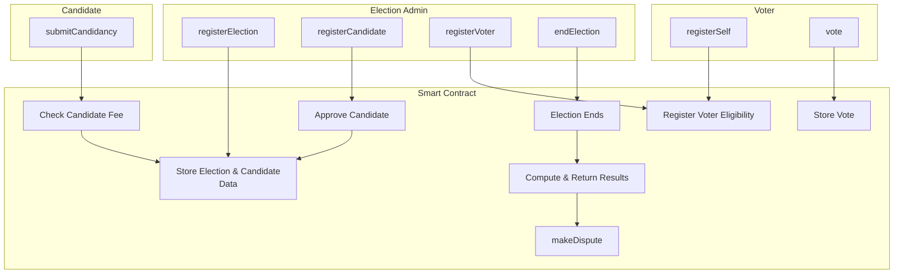

# Blockchain Protocols - Project

- [Blockchain Protocols - Project](#blockchain-protocols---project)
  - [Voting Web Application Based on the MultiversX Blockchain](#voting-web-application-based-on-the-multiversx-blockchain)
    - [Team Members](#team-members)
    - [Repository](#repository)
    - [Purpose of the Project](#purpose-of-the-project)
    - [Needs It Tries to Satisfy](#needs-it-tries-to-satisfy)
    - [Components of the Project](#components-of-the-project)
    - [Data Flow for Blockchain-Based Election App](#data-flow-for-blockchain-based-election-app)
      - [1. Election Registration](#1-election-registration)
      - [2. Candidate Registration](#2-candidate-registration)
      - [3. Candidate Approval](#3-candidate-approval)
      - [4. Voter Registration](#4-voter-registration)
      - [4a. Voter Registration by Admin](#4a-voter-registration-by-admin)
      - [5. Voting](#5-voting)
      - [6. Results](#6-results)
      - [7. Dispute Resolution](#7-dispute-resolution)
    - [High-Level Overview](#high-level-overview)
    - [Screenshots](#screenshots)
    - [Consideration for Future Enhancements](#consideration-for-future-enhancements)

## Voting Web Application Based on the MultiversX Blockchain

### Team Members

- [Vladislav Tiftilov](https://github.com/vladtf)
- [Ravariu Eugen](https://github.com/ravariu-eugen)

### Repository

- [Voting Web Application Based on the MultiversX Blockchain](https://github.com/vladtf/election-app-multiversx)

### Purpose of the Project

This project aims to create a decentralized voting platform using the MultiversX blockchain. The goal is to provide a secure and transparent voting system that eliminates manual vote counting, ensuring trust in the process.

### Needs It Tries to Satisfy

The platform addresses the following needs:

1. **Transparency**: All votes are recorded on the MultiversX blockchain, allowing participants to verify the results independently.
2. **Security**: Blockchain technology ensures that votes cannot be tampered with or altered after submission.
3. **Ease of Use**: A user-friendly interface simplifies the voting process, making it accessible to a wider audience.
4. **Cost-Effectiveness**: Using blockchain reduces overhead costs by automating vote recording and tallying.

### Components of the Project

The voting web application includes the following components:

1. **Frontend Interface**:
   - A web interface to:
     - Register users.
     - Allow users to cast their votes.
     - Display results once voting concludes.

2. **Smart Contracts**:
   - Smart contracts on the MultiversX blockchain to:
     - Register eligible voters.
     - Record votes on the blockchain.
     - Automatically tally and publish results.

3. **Administrative Panel**:
   - An interface for administrators to:
     - Set up elections (e.g., candidates, start/end times).
     - Monitor voting progress.

4. **Security Measures**:
   - Encryption for data transmission.
   - Voter authentication through unique access codes.

---

### Data Flow for Blockchain-Based Election App

#### 1. Election Registration

1. **Input**:
   - Election creator submits election details:
     - Election name, description.
     - start/end times.
     - Election type:
       - Plurality
         - 1 vote per voter
         - winner is the candidate with the most votes.
       - Approval
         - voter can choose any number of candidates to endorse  
         - winner is the candidate with the most endorsements.
       - Single Transferable Vote (STV)
         - a vote is an ordered list of candidates
         - each candidate gets the votes in which they are first
         - the candidate with the least votes is eliminated and their votes are redistributed to the remaining candidates
         - repeat this process until a candidate obtains a majority of votes

2. **Process**:
   - Smart contract validates and stores election metadata.
   - A unique `electionId` is assigned.
   - Election parameters (timing, thresholds) become immutable once set.

3. **Output**:
   - Election data is finalized on-chain.
   - Election creator is recorded as admin.

---

#### 2. Candidate Registration

1. **Input**:
   - Candidate submits a registration request:
     - `electionId`, candidate details (name, manifesto).
     - Candidate registration fee.

2. **Process**:
   - Smart contract checks:
     - Election has not ended.  
     - Fee payment validity.
     - Uniqueness of the candidate for this `electionId`.
   - Creates a `candidateId` for the candidate unique for this `electionId`.
   - Candidate status is `Pending` initially.

3. **Output**:
   - Candidate registration is recorded on-chain.

---

#### 3. Candidate Approval

1. **Input**:
   - Election admin approves candidate:
     - Inputs: `electionId`, `candidateId`.

2. **Process**:
   - Contract verifies:
     - Election has not ended.
     - Candidate is `Pending`.
     - Election admin is admin for this `electionId`.

3. **Output**:
   - Candidate status changes to `Approved`.

---

#### 4. Voter Registration

1. **Input**:
   - Voter submits their verification information.

2. **Process**:
   - Contract verifies:
      - Voter is not already registered.
      - Election has not started.
   - Sends verification request to the Voter Eligibility Service.

3. **Output**:
   - Voter registration is recorded on-chain.

**Eligibility Check**:  

- Voters submit identity and eligibility information to the off-chain Voter Eligibility Service.
- The service verifies:
  - Age.
  - Residency in the election region.
  - Citizenship or other required criteria.
- Verification can use:
  - Government databases.
  - Decentralized ID (DID) systems.
  - Biometric authentication.

#### 4a. Voter Registration by Admin

1. **Input**:
   - Election admin registers a new voter:
     - Inputs: `electionId`, `voterAddress`.
   - This bypasses the Voter Eligibility Service.

2. **Process**:
   - Contract verifies:
      - Election has not started.
      - Election admin is admin for this `electionId`.
      - Voter is not already registered.

3. **Output**:
   - Voter registration is recorded on-chain.

---

#### 5. Voting

1. **Input**:
   - During the voting phase, an eligible voter casts their votes.
   - Depending on the election type:
     - Plurality: Single candidate.
     - Approval: Unordered list of candidates.
     - STV: Ordered list of candidates.

2. **Process**:
   - Smart contract verifies:
     - Voter eligibility.
     - Voter’s compliance with election rules (e.g., cannot vote more than once for the same candidate, and must follow the rating constraints).
   - Records the voter’s rated votes on-chain.

3. **Output**:
   - All voting data (including ratings or multiple approvals) is immutably stored on-chain.
   - Allows for nuanced election outcomes beyond a simple single-choice vote.

---

#### 6. Results

1. **Input**:
   - At the end of the election, or upon admin finalization.

2. **Process**:
   - Smart contract tallies votes for each candidate.
   - Computes final scores or rankings.

3. **Output**:
   - Final results (scores, rankings) are published on-chain.

---

#### 7. Dispute Resolution

1. **Input**:
   - After results publication, a predefined dispute resolution window opens.
   - Stakeholders (candidates, election auditors, or a designated governance entity) can submit disputes.
   - Disputes can claim ineligible voters, fraud in signature collection, rating manipulation, or technical irregularities.

2. **Process**:
   - The smart contract may pause final result confirmation during dispute consideration.
   - A governance mechanism (e.g., a DAO vote, arbitration council, or zero-knowledge verifications) reviews the dispute.
   - If a dispute is upheld:
     - The contract may adjust certain votes, re-check eligibility, or re-run the tally under corrected conditions.
   - If no disputes or all disputes are resolved without changes:
     - The initial results stand and become final after the dispute window ends.

3. **Output**:
   - Confirmed final results or updated results post-dispute.
   - A transparent, on-chain record of the dispute and its resolution.

---

### High-Level Overview

1. **Election Registration**:  
   - Election is created, parameters fixed, and `electionId` set.

2. **Candidate Registration**:  
   - Candidates join, pay fees, and receives `candidateId`.

3. **Candidate Approval**:  
   - Admin approves candidates.

4. **Voter Registration**:  
   - Voter is registered either by admin or through the Voter Eligibility Service.

5. **Voting**:  
   - Eligible voters cast votes depending on election type.

6. **Results**:  
   - Votes tallied, final rankings/scores on-chain.

7. **Dispute Resolution**:  
   - Post-results dispute window ensures fairness and integrity before finalizing outcomes.

### Screenshots

- **Submit Candidacy**:

- **Register Election**:

- **Vote** and **End Election**:

### Consideration for Future Enhancements

Below are several additional points to consider for improving fairness, usability, and accessibility in the election process:

1. **Enhanced Privacy Measures**:  
   - **Zero-Knowledge Proofs (ZKPs)**: Integrate ZKPs or other cryptographic primitives so that votes can be verified without revealing which candidate the voter supported. This ensures that while the tally is correct, individual voter choices remain private.  
   - **Mix Networks or Voting Pools**: Implement mixing solutions so that individual votes cannot be traced back to a single voter, reinforcing ballot secrecy.

2. **Voter Education & UX Improvements**:  
   - **User-Friendly Interface**: Provide a clear and intuitive user interface for casting votes and signing petitions. Include step-by-step guidance to minimize user confusion.  
   - **Multi-Language Support**: Offer the voting interface in multiple languages and use accessible design principles to ensure inclusivity for voters with varying needs.  
   - **Voter Previews & Confirmation**: Let voters preview their selected candidates and ratings before final submission. Offer a short confirmation step to minimize accidental votes.

3. **Robust Identity Management**:  
   - **Biometric or DID Integration**: Consider more advanced forms of identity verification, such as DID-based verifications that can be cryptographically tied to a single real-world identity, reducing the risk of voter duplication or impersonation.  
   - **Anti-Sybil Mechanisms**: Implement stronger anti-Sybil attack measures, ensuring one-person-one-vote. Non-transferable tokens tied to verifiable identities can help eliminate multiple registrations by the same individual.

4. **Trusted Setup and Governance**:  
   - **Transparent Deployment**: Make the election’s smart contract code open-source and publicly audited before the election starts. Independent audits by reputable blockchain security firms ensure the code is fair and free from backdoors.  
   - **On-Chain Governance**: Allow community or independent overseers (e.g., an unbiased committee or DAO) to have a limited role in parameter adjustments before the election begins, ensuring no unilateral admin changes can skew the process.

5. **Clear Rules and Documentation**:  
   - **Publicly Documented Procedures**: Clearly define and publish all election rules, including candidate requirements, fee structures, dispute mechanisms, and the logic behind the rating system. Transparency fosters trust and understanding.  
   - **Formalized Criteria for Disputes**: Specify strict criteria and processes for handling disputes. Outline what kinds of evidence must be presented, how decisions are made, and the timelines. The clearer the process, the fewer conflicts or confusion.

6. **Scalability and Performance**:  
   - **Layer-2 or Sidechain Solutions**: If transaction fees and latency on the main blockchain are high, consider a Layer-2 solution (e.g., rollups) for registering votes and signatures. This improves user experience by reducing transaction costs and wait times, making the election more accessible.  
   - **Batch Processing & Aggregation**: For large-scale elections, consider batching votes into cryptographic commitments (e.g., via Merkle trees) to reduce on-chain storage costs, improve performance, and still provide verifiable proofs of correctness.

7. **Post-Election Auditing Tools**:  
   - **On-Chain Proof Generation**: Provide automated on-chain or off-chain tools to let any third party verify the election results against the recorded votes. This encourages transparency and gives voters and observers confidence in the tally.  
   - **Permanent Public Record**: Maintain all election data (metadata, tallies, challenges, and resolutions) in an easily accessible format for future audits or historical reference.

8. **Fair Candidate Promotion & Equal Opportunity**:  
   - **Equal Visibility**: Ensure the interface and smart contracts do not inherently privilege certain candidates (e.g., by listing them in a certain order that might create bias). Randomizing candidate order or giving them equal prominence can help ensure fairness.
